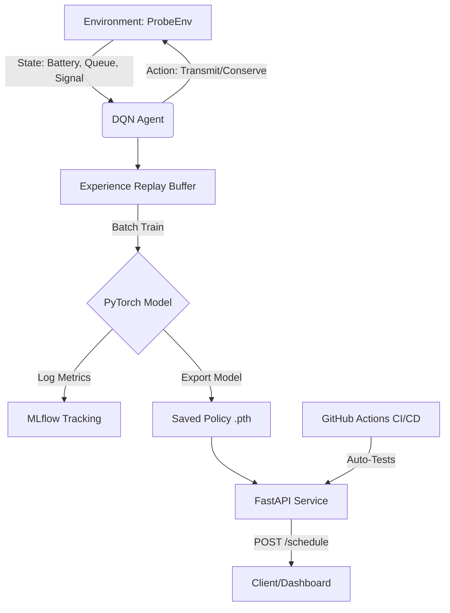

# Deep Space Probe Communication Scheduling using Deep Q-Networks (DQN) and MLOps

## 1. Problem Statement & Project Overview
Deep-space probes operate in highly resource-constrained environments where communication opportunities are limited and mission resources must be utilized efficiently. This project uses a **Deep Reinforcement Learning (DQN)** agent to autonomously learn how to prioritize communication tasks, optimize transmission decisions, conserve probe energy, and maximize mission efficiency. 

By replacing a traditional rule-based scheduler with an adaptive AI, we drastically increase the survival time and efficiency of the satellite.

**SDG Alignment:** This project directly supports **SDG 9 (Industry, Innovation and Infrastructure)** and **SDG 12 (Responsible Consumption and Production)** by optimizing space communication bandwidth, onboard storage, and critical energy resources.

## 2. Architecture Diagram


## 3. Reproducibility & Run Instructions
To achieve the exact results demonstrated, simply clone the repository and run the commands below.

### Setup
```bash
pip install -r requirements.txt
```

### Reproducing the Experiment
Run the training pipeline which tracks experiments using MLflow and saves the metrics and policies:
```bash
python training/train.py --config configs/dqn_config.yaml
```
*Metrics will be saved to `experiments/metrics/training_metrics.csv` and the model to `experiments/saved_models/dqn_policy_final.pth`.*

### Evaluation & Baseline Comparison
Compare the trained DQN agent with the rule-based baseline scheduler and generate visualizations:
```bash
python evaluation/evaluate.py
```
*Check the `plots/` and `results/` folders for the baseline vs RL outputs.*

## 4. MLOps Automation & Deployment
We implement full MLOps practices including Containerization, CI/CD, and monitoring.

### Docker Containerization
You can deploy the entire API automatically using Docker Compose:
```bash
docker-compose up --build
```
This serves the API on `http://127.0.0.1:8000/`.

### FastAPI Service Endpoints
- **GET /status**: Check system health.
- **POST /schedule**: Request an optimal action for a given space-probe state.

### CI/CD Pipeline
We use **GitHub Actions** (`.github/workflows/ci.yml`). Every push or pull request to the `main` branch automatically provisions an Ubuntu runner, installs dependencies, and runs the training and evaluation pipelines to ensure no code breaks the RL agent.

## 5. Monitoring Plan (Production)
If deployed in a real-world deep-space probe, our monitoring strategy tracks model drift and operational constraints:
* **Metric Monitored:** Average wait-time in queues, battery depletion rate, and transmission failure rates.
* **Drift Detection:** If the satellite encounters a completely new cosmic weather pattern where signal strength distribution shifts significantly from training data, we will monitor the average reward drop. A drop below a safety threshold (e.g., -10) will trigger an automatic alert to mission control.
* **Logs:** Live prediction logs are simulated and saved via `python monitoring/monitor.py`.

## 6. Versioning (GitOps & Models)
* **Code:** Full Git version control used.
* **Experiment Tracking:** MLflow acts as our model registry. Run `mlflow ui --backend-store-uri sqlite:///mlflow.db` to view.
* **Data:** Since the environment is generated dynamically via Gym, Data Versioning (DVC) is strictly tied to the `probe_env.py` logic versions.
